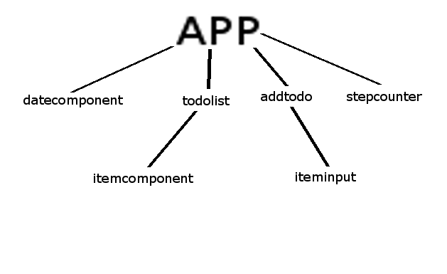

# IT2810 Webutvikling Prosjekt 3

## Avgrensning av oppgaven
Applikasjonen vår heter «Dagsplanlegger’n». Poenget med den er å kunne ha en «Personal Information and Motivation Manager» med fokus på dagen i dag. Det finnes hundrevis av kalendere og todoapplikasjoner, men med slike applikasjoner er det lett å være ivrig i starten, planlegge masse ting, for så at alt går i glemmeboken fordi det blir for overveldende. Derfor så vi behovet for en applikasjon hvor fokuset var på det man har å gjøre i dag. Vi har også lagt til en navigering, hvor man kan gå en dag fram i tid (og en dag tilbake), og det er for å kunne planlegge morgendagen i tillegg. Vi har også laget appen slik at utvidelse av antall dager man har oversikt over vil være enkel. Motivasjonsdelen av oppgaven oppfylles ved at man ser hvor mange oppgaver man har gjennomført, og man ser hvor mange skritt man mangler for å oppnå skrittmålet sitt. Har man oppnådd målet vil det dynamisk komme en tekst som forteller deg dette.

## Funksjonalitet
Hovedfunksjonaliteten til appen vår er at man kan opprette gjøremål og skrittmål. Et skrittmål vil ikke dukke opp i lista over gjøremål, men heller oppdatere skrittmålet ditt litt lenger ned i appen. Du kan kun ha ett skrittmål per dag.

### ToDo-liste:
Dette er som beskrevet over en slags huskeliste der man kan legge til gjøremål. Man vil ha muligheten til å markere et gjøremål som ferdig og/eller slette gjøremålet. Appen teller antall ferdige gjøremål.

### Skritteller:
En skritteller som henter ut antall skritt for den nåværende dagen, og sjekker dette opp mot skrittmålet du har oppgitt i appen. Vi hadde et problem med skrittelleren på android, dette problemet er nærmere beskrevet i "funksjonstesting" lenger ned. For å implementere skrittelleren brukte vi kode fra expo dokumentasjonen, som også er nærmere lenger ned.

### Datoviser:
Vi har valgt å ikke implementere en kalender i vår app, men heller utvide ToDo-lista slik at man får opp en liste med gjøremål for hver dag. Datoviseren er foreløpig implementert slik at man kan gå en dag fram i tid, og en dag tilbake i tid. Dette er for å enkelt kunne planlegge en dag frem i tid.

## Komponentstruktur
Vi valgte å strukturere komponentene i appen som på bildet under:

Noen vil kanskje mene at appen vår er delt opp i litt mange komponenter, men vi mener dette er hensiktsmessig da dette gir oss god oversikt over hvilken kode som er hvor.

### Styling
Etter anbefaling fra fagstaben valgte vi også å ha et stylesheet for hver komponent. Vi samlet stylesheet'ene i en egen mappe, og navnga de etter hvilken fil de skulle style. Ved å organisere det på denne måten sørger vi for at lengden på hvert stylesheet blir minimal, og at vi har oversikt over hvor de ulike komponentene har sin tilhørende styling.

## Teknologi

### React Native

Som spesifisert i oppgaveteksten skulle løsningen vår basere seg på React Native med bruk av Expo verktøyet. React Native er ganske likt React som vi brukte i forrige prosjekt, der den største forskjellen er at man i React Native ikke bruker web-komponenter, men heller native-komponenter. React Native var ganske greit å sette seg inn i når vi hadde erfaringen fra forrige prosjekt.

### Expo

## Tredjepartskomponenter og bibliotek
For å lage en brukervennlig «Dagsplanlegger» med skrittmål trengte vi å bruke mobilens skritteller. Til dette har vi brukt expo sitt Pedometer API. Dette ga oss akkurat det vi var ute etter, og dette API’et bygger på Core Motion for iOS og Google Fit for Android.
https://docs.expo.io/versions/latest/sdk/pedometer
For å ta den i bruk må man 
Import Expo from «expo»;
Import { Pedometer } from «expo»;
Vi har stort sett brukt den samme koden som det eksemplet de viser, men har tilpasset det slik at skrittelleren starter fra klokken 00:00 og varer til 23:59 i stedet for å se på de siste 24 timene. Dette gjør at det passer inn i vår «Dagsplanlegger».

Under testingen har vi også hentet noen pakker.
Det første vi bruker kommer fra «mock-async-storage» og den bruker vi til å lage et mockobjekt til asyncStorage. 
Den installeres med «npm install --save mock-async-storage»
Og når man importerer definerer man to funksjoner. En for å sette opp objektet og en for å ta den ned igjen. Dette har vi så lagt ihhv beforeAll og afterAll funksjonene.

## Bruk av GitHub
Vi har brukt GitHub og issuetracking her aktivt helt fra starten av prosjektet slik at vi alltid har hatt en god oversikt over fremgangen i prosjektet.

Vår "hoved"-branch under utviklingen har vært "dev"-branchen, der vi til enhver tid har hatt en fungerende versjon av appen. Når kode skrevet i andre brancher anses som ferdig har vi dyttet (merget) denne koden til dev

Ellers har vi navngitt de aller fleste branchene basert på en standard der vi skiller mellom for eksempel en ny feature (feat), og en hotfix på følgende måte:

For en ny feature:

> feat/navnPåFeatureHer

Eller for en hotfix:

> hotfix/navnPåHotfixHer

Vi knyttet også commits opp mot issues på github. Dette gjør det lettere å se hva andre jobber på og hva som er gjort i hver commit. Vi brukte også funksjonaliteten i GitHub som gjør at man kan tildele medlemmer ulike issues. Det blir da lettere å få en oversikt over hvor mye og hva slags arbeid som gjenstår.

Underveis i utviklingen av applikasjonen har vi brukt mye parprogrammering. Det kan derfor hende av en av medlemmene i gruppa har vesentlig mer kode commitet til prosjektet, men vi anslår selv at arbeidsfordelingen har vært ganske så jevn.

## Testing
Prosjektet er testet med Jest. Vi har testet at komponentene laster inn riktig ved å lage snapshots, og vi har testet funksjoner som endrer state.

### Snapshottesting
For at testene skulle kjøre igjennom, måtte vi lage et mock object av Date funksjonen til JavaScript. Dette fordi at vi i applikasjonen har et felt i state som bruker New Date(). Mocking av Date er også iht retningslinjene til Jest, som sier at all data i snapshottester bør være deterministisk.
I tillegg har vi fokusert på å gi testene gode beskrivelser. Alle snapshottene er derfor beskrevet slik de burde rendes.
Alle snapshottestene blir godkjent, bortsett fra App. Vi fikk ikke til å mocke Date konstroktøren, så her må man kjøre npm test -- --u for at Snapshoten skal bli riktig. Noen spesifikke komponenter rendrer forskjellig basert på hvilken input vi gir dem, og på disse har vi bare valgt å laste inn en av de (ettersom vi mener dette er nok for å illustrere testing av komponenten).

Det vi har misset litt på er å behandle snapshots som kode, altså å ha de med under utviklingen. Testene ble stort sett skrevet på slutten, og om vi skulle ha gjort det på nytt i et ekte system ville vi ha skrevet de underveis, slik at vi kunne brukt de til å feilsøke kode under utvikling.

### Testing av funksjoner
Vi har skrevet enhetstester for de fleste funksjonene som brukes til lagring av state.
Stepcounter komponenten er tatt fra expo docs, og vi har ikke skrevet noen egne spesifikke enhetstester her annet enn snapshot tester.

I App komponenten har vi brukt AsyncStorage, og for å teste denne har vi tatt i bruk MockAsyncStorage fra pakken 'mock-async-storage'. Denne setter vi opp før testen, og fjerner den når alle testene er kjørt. AsyncStorage ser vi funker i funksjonene våre, da vi tester den opp mot addItem funksjonen og den returnerer riktig.

Vi har ikke fokusert veldig på å få et høyt coverage tall, men vi har uansett vist at vi kan å teste. Det viktigste for at systemet fungerer er testet og vi ser at funksjonene gjør det de skal. I tillegg har vi vist at vi kan Mocke objekter, og bruke dette i testingen vår.

### Funksjonstesting
Vi har også funksjonstestet applikasjonen under utvikling, og når den har blitt ferdig.
Under utvikling har vi fått en Androidbug:
Når vi kjører appen samtidig som vi lagrer endringer i koden - og appen autooppdateres får vi en feilmelding med at det allerede finnes en GoogleApiClient med id 0. Dette får vi kun under utvikling, og har valgt å ikke bruke mye tid på å prøve å rette det, da det ikke gir noen funksjonelle utfordringer under bruk.
